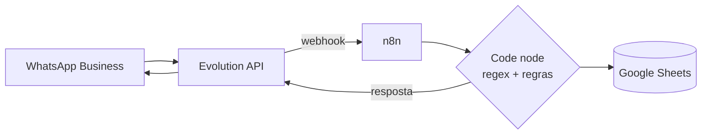

# LabFlow

Automação de laboratório de microbiologia via WhatsApp: o analista manda uma mensagem, e o LabFlow registra coletas e análises numa planilha, calcula os prazos de leitura e reanálise e responde quais tarefas vencem no dia.

Projeto de portfólio da minha transição de carreira de Biomedicina / Controle de Qualidade para Tecnologia da Informação. O problema vem da rotina real de um laboratório de controle de qualidade de suco. Todo o desenvolvimento e os testes usam **dados fictícios**.

**Status:** em uso de teste no servidor (VPS), com regras de negócio, permissões por cargo e registro de análises funcionando ponta a ponta. Próxima fase: interpretação de mensagens com IA.

## O problema

No laboratório, cada coleta de tanque gera uma série de prazos: análises com pré-leitura e leitura final em horas diferentes, reanálises (drops) em D5, D10 e D15, e descarte da amostra de arquivo depois de 1 ano. Esse controle depende de anotação manual e de lembrar o que vence em cada dia.

O LabFlow deixa o registro no canal que a equipe já usa (WhatsApp) e passa o cálculo dos prazos para o sistema.

```
Você:     registrar coleta tanque terra 42,43 data 20/09/2026
LabFlow:  ✅ Coleta registrada — tanques 42, 43
          Drops: D5 25/09 · D10 30/09 · D15 05/10

Você:     Quais analises de tanques terra saem hoje?
LabFlow:  CT (48hrs) Tanques 47 e 49 analise normal
          BL (72hrs) Tanques 37 e 40 analise normal
```
<sub>Respostas resumidas para ilustração.</sub>

## Funcionalidades

**Registro**
- Coleta de tanque de terra (até 8 tanques por mensagem) e de navio (até 16 tanques, com nome + viagem)
- Cálculo automático dos drops D5/D10/D15 e da data de descarte do bag/pote de arquivo (+365 dias)
- Registro de análise Normal ou Stress: cada tanque gera CT, BL e WORT (Profundidade e Superfície) com datas de pré-leitura e leitura final
- Registro de amostra avulsa

**Consulta**
- Drops que vencem hoje (terra e navio na mesma resposta)
- Análises que saem hoje, agrupadas por sub-análise, prazo em horas e frasco
- Bags e potes que podem ser descartados hoje

**Atualização**
- Conclusão de drops em lote, filtrando por dia (D5/D10/D15), terra/navio e navio

**Controle e segurança**
- Só números cadastrados usam o bot; três cargos (Admin, Operador, Consultor)
- Gestão de cargos pelo próprio WhatsApp, restrita a Admin
- Bloqueio de coleta duplicada (mesmo tanque, mesma data)
- Validação de formato com mensagem de erro explicando o formato esperado

Lista completa com formato e exemplo de cada comando: [docs/comandos.md](docs/comandos.md).

## Arquitetura



- **Evolution API** (self-hosted) conecta um número de WhatsApp Business e envia cada mensagem recebida para o n8n.
- **n8n** filtra a mensagem, confere o cargo do remetente, identifica o comando por regex e aplica as regras de negócio (prazos, duplicata, permissões).
- **Google Sheets** guarda os dados em abas separadas: coletas, drops, análises, arquivo e usuários.
- Tudo roda em **Docker**, numa stack isolada em um VPS Linux, sem nenhuma porta exposta publicamente (acesso administrativo só por túnel SSH).

Detalhes em [docs/arquitetura.md](docs/arquitetura.md) e [docs/deploy-vps.md](docs/deploy-vps.md).

## Stack

n8n · Docker / Docker Compose · Evolution API · PostgreSQL · JavaScript · Google Sheets API · Webhooks · Linux (VPS) · SSH

## Decisões técnicas

- **Regex antes de IA.** Comandos com formato definido são previsíveis e fáceis de testar. Na fase de IA, a regex continua sendo a primeira tentativa e o modelo só entra quando ela não reconhece a mensagem.
- **Evolution API em número dedicado.** Por ser uma integração não oficial, usa um eSIM separado com WhatsApp Business, sem arriscar um número pessoal.
- **Segredos fora do workflow.** A chave da Evolution API fica numa Credencial do n8n e o Google Sheets usa conta de serviço, então o JSON exportado do workflow não carrega segredo nenhum.
- **Revisão do JSON depois de mudanças estruturais.** Religar conexões à mão no editor já introduziu bugs que só apareceram na revisão do export (ver Bug 15 em [troubleshooting](docs/troubleshooting.md)).

## Roadmap

- [x] **V1 — MVP:** WhatsApp + n8n + Google Sheets, registro e confirmação
- [x] **V2 — Regras de negócio:** drops, arquivo/descarte, análises com prazos, permissões, duplicata, conclusão em lote
- [ ] **V3 — IA:** interpretação de linguagem natural como fallback da regex, comando por áudio, leitura de laudo por foto (com confirmação antes de gravar)
- [ ] **V4 — Banco de dados:** migração do Google Sheets para PostgreSQL
- [ ] **V5 — Dashboard:** indicadores de pendentes, concluídos e atrasados no Power BI (hoje há um painel simples na própria planilha)
- [ ] **V6 — Acabamento:** testes, diagramas e documentação final

Próximo recurso planejado: análises de recebimento e embarque de suco concentrado, com planilha própria (identificação por Load/Lote/Item/Fábrica).

## Documentação

| Documento | Conteúdo |
|---|---|
| [comandos.md](docs/comandos.md) | Todos os comandos do bot, cargos e permissões |
| [arquitetura.md](docs/arquitetura.md) | Nodes do workflow, abas da planilha e decisões de design de cada etapa |
| [troubleshooting.md](docs/troubleshooting.md) | 15 bugs reais: sintoma, causa raiz, solução e lição |
| [deploy-vps.md](docs/deploy-vps.md) | Infraestrutura no VPS: rede, segredos, acesso SSH, migração |
| [CHANGELOG.md](docs/CHANGELOG.md) | Histórico de versões |

## Dados e privacidade

Nenhum dado real de empresa é usado neste projeto. Números de tanque, navios, nomes e telefones nos testes e na documentação são fictícios. O uso com dados reais dependeria de aprovação da empresa e de adequação à LGPD (base legal, controle de acesso e retenção dos dados).

## Autor

**Danyllo** — biomédico em transição para TI, estudante de Ciência da Computação.
