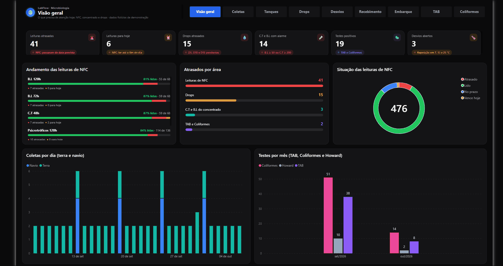
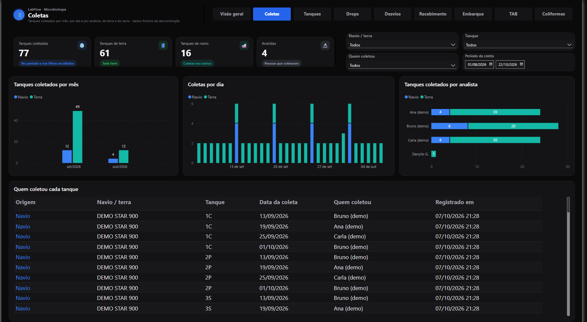
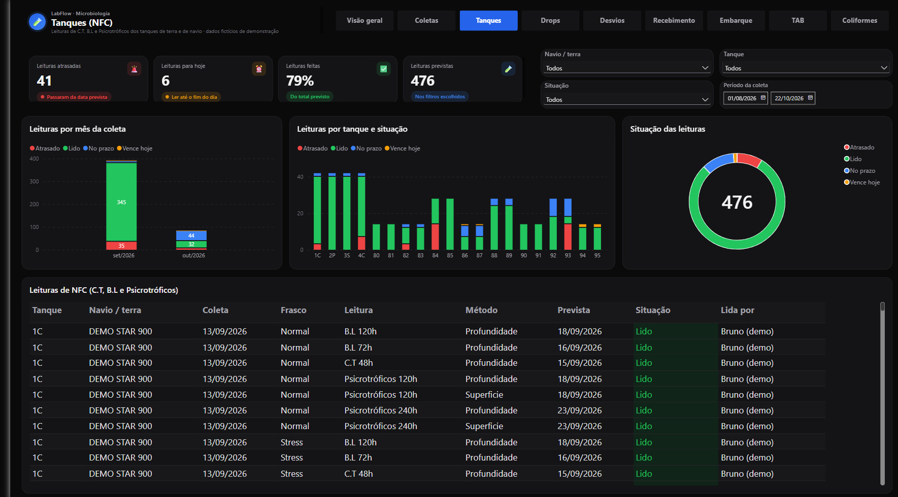
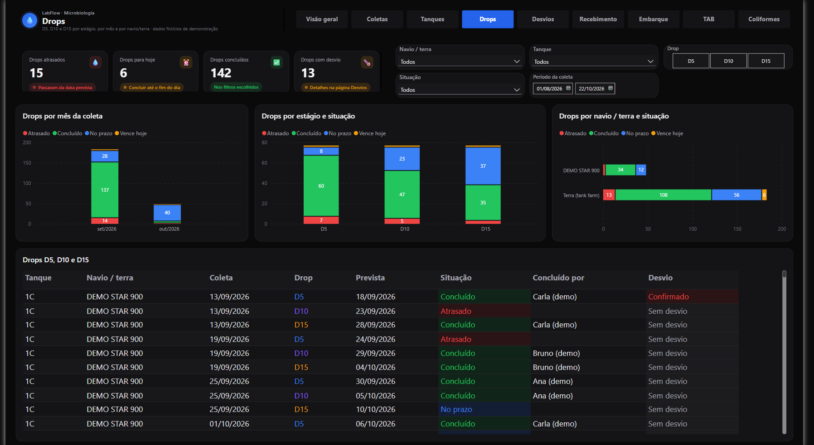
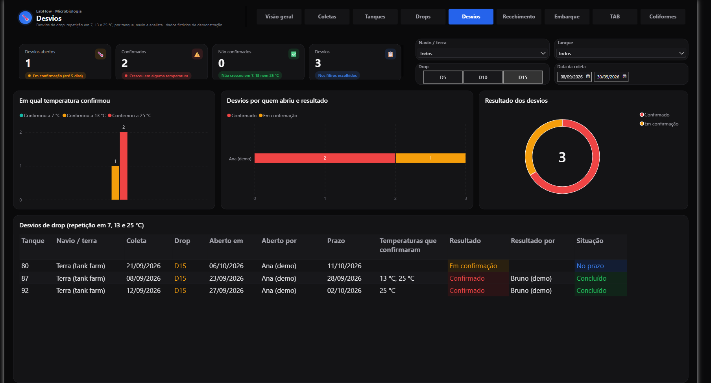
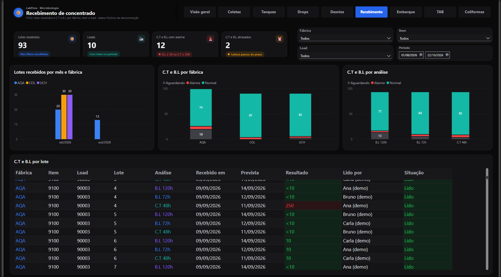
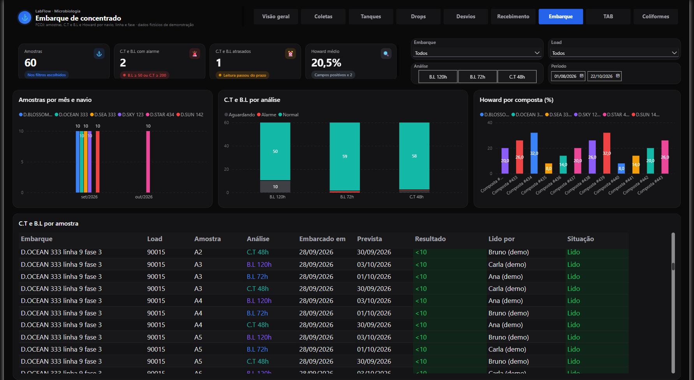
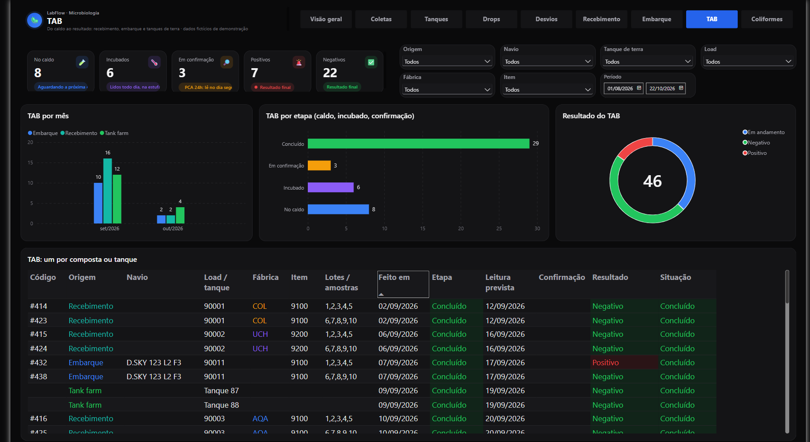
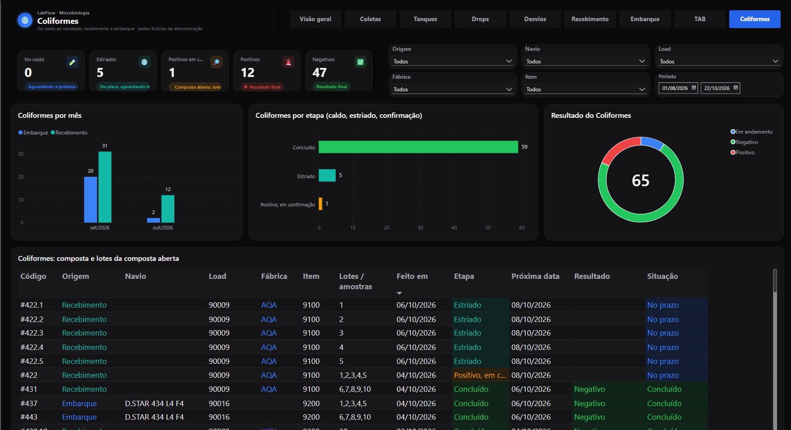
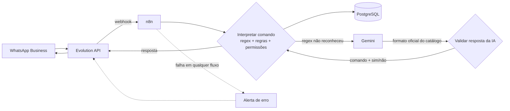

# LabFlow

[](https://github.com/danyllo153/labflow-whatsapp-automation/actions/workflows/audit-workflow.yml)
[](https://github.com/danyllo153/labflow-whatsapp-automation/actions/workflows/testes.yml)

**Automação de laboratório de microbiologia pelo WhatsApp.** O analista manda uma mensagem (no formato do comando ou do jeito que falaria), e o LabFlow registra coletas, análises e resultados num banco PostgreSQL, calcula todos os prazos de leitura, avisa o que vence no dia e monta sozinho o **relatório diário de microbiologia**.

Projeto pessoal que une biomedicina e automação: o problema vem da rotina real de um laboratório de controle de qualidade de suco. Roda num servidor de demonstração, sempre com **dados fictícios**.

## Onde o projeto está

**Versão publicada: [v1.1.0](docs/CHANGELOG.md)**, em uso de teste ponta a ponta pelo WhatsApp. Já entrou na `main` e vai para a próxima versão:

- **A IA entende todos os comandos.** Frase livre ("chegaram os lotes 1 a 14 do load 77001 item 444 da fábrica AQA", "apareceu colônia no TAB 11", "relatório diário") vira o comando oficial; o código confere antes de gravar. Testada no Gemini real com 44 frases que não estão no prompt: **44 de 44**, inclusive frases em estilo de áudio.
- **Leitura do dia finalizada:** quem lê o dia fecha tudo o que vence hoje de uma vez, e o relatório mostra quem finalizou.
- **Desvio de drop:** drop "não ok" abre um desvio, com repetição em 7, 13 e 25 °C e resultado por temperatura, consultável por tanque.
- **Alerta de erro no WhatsApp:** se um fluxo do bot falha, os administradores recebem o aviso na hora (validado de ponta a ponta).
- **Painel no Power BI:** 9 páginas (visão geral, coletas, tanques, drops, desvios, recebimento, embarque, TAB e Coliformes) em modo escuro, com filtros por navio, tanque, load, fábrica, item e período. O painel é **gerado por código** e versionado no Git, o modelo foi montado com o Power BI Modeling MCP da Microsoft, e os números foram conferidos contra o banco.

**Próximo:** fechar a próxima versão (Situação ok/não ok em todo o relatório) e começar a base de um **LIMS próprio** (histórico de alterações, especificações e liberação de resultados), rumo a um app web/mobile.

| Em números | |
|---|---|
| Nodes no workflow do n8n | 177, em 10 blocos por assunto |
| Tipos de comando | 39 |
| Consultas ao banco | 49, todas parametrizadas |
| Banco | 15 migrations versionadas, 19 tabelas, 12 views (relatório e painel) |
| Painel | Power BI com 9 páginas, gerado por código |
| Testes automáticos | 208 (`npm test`), rodando a cada alteração numa GitHub Action |
| Bugs reais documentados | 33, com causa raiz e lição ([troubleshooting](docs/troubleshooting.md)) |

## O problema

Cada coleta de tanque gera uma série de prazos: análises com pré-leitura e leitura final em horas diferentes, análises de drop em D5, D10 e D15, e descarte da amostra de arquivo depois de um ano. No suco concentrado, cada carreta (lote) e cada amostra de embarque tem C.T e B.L com prazo próprio, e as compostas passam por TAB, Coliformes e Howard, cada um com o seu ciclo de caldo, estria, incubação e confirmação. Tudo isso termina num relatório diário que era montado à mão, numa planilha.

O LabFlow deixa o registro no canal que a equipe já usa (WhatsApp), calcula os prazos e gera o relatório.

## Como é usar

```
Você:     recebimento load 77001 item 444 fabrica AQA lotes 1-14
LabFlow:  ✅ Recebimento do load 77001 (item 444, fábrica AQA) registrado por Ana.
          Lotes recebidos: 1-14 (14)

Você:     compostas do load 77001 (1-5)(6-10)(11-14)
LabFlow:  ✅ 3 compostas criadas no load 77001:
          #4 lotes 1-5 · #5 lotes 6-10 · #6 lotes 11-14

Você:     apareceu colônia no TAB 5                       ← frase livre: passa pela IA
LabFlow:  🤖 Entendi: tab #5 em confirmação
          Responda sim para confirmar ou não para cancelar.

Você:     o drop D5 do tanque 45 da coleta de 30/09/2026 deu ruim
LabFlow:  ❓ Drop não ok: abrir desvio do drop D5 do tanque 45 (coleta 30/09/2026)?
          Repetição do drop de arquivo em 7 °C, 13 °C e 25 °C, leitura até 10/10/2026.

Você:     relatório do dia
LabFlow:  📋 Relatório do dia 05/10/2026
          FCOJ — Recebimento
          C.T 48h: 77001 (1-5 ✅, 6 🚨, 7-14)
          TAB: 77001 (1-5 ✅)(6-10 🚨)
          ...
          NFC — Tank farm
          Drop 5: 45 🚨, 46 ✅
          🚨 C.T 48h ≥ 200 — 77001: lote 6 = 250
          ✅ Leitura do dia finalizada por Ana às 16:40.
```
<sub>Respostas resumidas, com dados fictícios. Todos os comandos, com formato e exemplo: [docs/comandos.md](docs/comandos.md).</sub>

## Painel no Power BI

O que o bot grava vira um painel de 9 páginas para o laboratório acompanhar prazos, atrasos e resultados. Cada página segue o mesmo padrão: cartões e filtros no topo, três gráficos e uma tabela. O painel é **gerado por código** ([`scripts/gerar-painel-powerbi.js`](scripts/gerar-painel-powerbi.js)) e versionado no Git em formato PBIP; o modelo de dados foi montado com o **Power BI Modeling MCP** da Microsoft, e os números foram conferidos contra o banco.



| | | |
|---|---|---|
| [](docs/img/powerbi/02-coletas.png)<br>**Coletas** | [](docs/img/powerbi/03-tanques.png)<br>**Tanques (NFC)** | [](docs/img/powerbi/04-drops.png)<br>**Drops** |
| [](docs/img/powerbi/05-desvios.png)<br>**Desvios** | [](docs/img/powerbi/06-recebimento.png)<br>**Recebimento** | [](docs/img/powerbi/07-embarque.png)<br>**Embarque** |
| [](docs/img/powerbi/08-tab.png)<br>**TAB** | [](docs/img/powerbi/09-coliformes.png)<br>**Coliformes** | [](docs/img/powerbi/01-visao-geral.png)<br>**Visão geral** |

<sub>Dados fictícios de demonstração. Clique numa imagem para ver em tamanho real.</sub>

## Funcionalidades

**Tanques de NFC (suco não concentrado)**
- Coleta de tanque de terra (até 8 por mensagem) e de navio (até 16, com nome e viagem), com os drops D5/D10/D15 e o descarte do bag ou pote de arquivo (+365 dias) calculados na hora
- Análise Normal ou Stress (C.T, B.L e Psicrotróficos, com pré-leitura e leitura final), que exige a coleta do tanque
- Consultas do que vence hoje e conclusão em lote, com confirmação "sim/não" e registro de quem leu
- Desvio de drop: drop "não ok" abre a repetição em 3 temperaturas, com resultado e histórico por tanque

**Suco concentrado (FCOJ)**
- Recebimento de lotes por load, item e fábrica; compostas de 1 a N lotes, com número curto (`#12`)
- Embarque por navio, linha e fase, com amostras A1, A2...
- TAB (de composta e de tanque), Coliformes (confirmação abrindo a composta lote a lote) e Howard (% de campos positivos), cada um com o seu ciclo, lista do dia e atrasados com a data prevista
- C.T e B.L por lote e por amostra, vários resultados numa mensagem, com alarme em B.L ≥ 50 e C.T ≥ 200

**Relatório diário de microbiologia**
- Os quatro blocos da planilha oficial (FCOJ recebimento e embarque, NFC tank farm e navio) numa mensagem, com ✅ no lido e 🚨 no que passou do limite, deu positivo ou abriu desvio
- `relatório do dia completo` traz só o lido, com `ok` / `não ok`; filtros por bloco
- `leitura do dia finalizada` fecha o dia de uma vez e registra quem leu

**IA (Google Gemini)**
- Entra só quando a regex não reconhece a mensagem, e cobre todos os comandos: o modelo reescreve a frase no formato oficial de um catálogo, e o código confere o formato, decide se pede "sim" e manda o comando de volta pela regex, que valida tudo de novo
- Dado faltando vira pergunta ("Faltou o item e a fábrica do load"); nada é inventado. Números falados por extenso viram algarismos, preparando o comando por áudio

**Operação e segurança**
- Só números cadastrados usam o bot; cargos Admin, Operador e Consultor (só consulta), com a permissão conferida no código
- Alerta de erro no WhatsApp para os Admin, sem expor o texto das mensagens e sem repetir o mesmo erro em 10 minutos
- Backup diário do banco (14 dias), servidor sem nenhuma porta exposta (acesso só por túnel SSH)

## Arquitetura


```mermaid
flowchart LR
    A[WhatsApp Business] --> B[Evolution API]
    B -- webhook --> C[n8n]
    C --> D{Interpretar comando<br/>regex + regras + permissões}
    D --> E[(PostgreSQL)]
    D -- "regex não reconheceu" --> F[Gemini]
    F -- "formato oficial do catálogo" --> G{Validar resposta da IA}
    G -- "comando + sim/não" --> D
    D -- resposta --> B
    B --> A
    C -. "falha em qualquer fluxo" .-> H[Alerta de erro] -.-> B
```

- **Evolution API** (self-hosted) conecta um número dedicado de WhatsApp Business e manda cada mensagem para o n8n.
- **n8n** identifica o comando por regex, confere o cargo de quem mandou, aplica as regras de negócio e responde. O workflow é organizado em blocos por assunto (entrada, consultas, coletas, análises, sim/não, IA, cargos, concentrado, desvio).
- **Gemini** só é chamado quando a regex não reconhece a mensagem. Ele propõe; o código decide.
- **PostgreSQL** guarda tudo em tabelas ligadas por chave estrangeira (no NFC a coleta é o centro; no concentrado, *recebimento → compostas → testes*), e confere as regras de novo: duplicata, valores permitidos, temperaturas do desvio, um teste por composta.
- Tudo em **Docker**, numa stack isolada num VPS Linux.

Detalhes em [docs/arquitetura.md](docs/arquitetura.md), [docs/concentrado.md](docs/concentrado.md) e [docs/deploy-vps.md](docs/deploy-vps.md).

## Stack

n8n · PostgreSQL · Docker / Docker Compose · Evolution API · Google Gemini API · JavaScript · SQL · Node.js (testes) · Python (auditoria) · GitHub Actions · Linux (VPS) · SSH

## Engenharia e qualidade

- **Testes dos Code nodes fora do n8n.** O código real dos nodes é extraído do workflow exportado e executado com mensagens de exemplo (`npm test`, 208 testes): reconhecimento de cada comando, campos extraídos, prazos de negócio, recusas, permissões, a validação da IA e o alerta de erro. Os testes foram validados **injetando defeitos de propósito**: um teste que nunca falha não protege nada.
- **Regressão do prompt.** O Gemini não roda offline, então um script gera um workflow de teste com o mesmo prompt do bot e frases que não estão nos exemplos, e mostra um placar ([scripts.md](docs/scripts.md)). Roda depois de qualquer mudança no prompt.
- **Auditoria automática do workflow.** [`scripts/audit-workflow.py`](scripts/audit-workflow.py) procura nodes órfãos, ramos sem resposta ao webhook e dados sensíveis no arquivo público. Duas GitHub Actions rodam a auditoria e os testes a cada alteração.
- **Banco versionado.** 12 migrations numeradas, aplicadas uma de cada vez, sempre testadas antes numa transação desfeita e com backup antes de aplicar.
- **Bugs documentados.** 30 bugs reais com sintoma, causa raiz, solução e lição ([troubleshooting](docs/troubleshooting.md)).

## Decisões técnicas

- **Regex antes de IA.** Comando com formato definido é previsível e testável. A regex é sempre a primeira tentativa; o modelo só entra quando ela não reconhece a mensagem.
- **A IA sugere, o código executa.** O Gemini nunca grava nada: ele traduz a frase num comando oficial, e esse comando volta ao mesmo webhook e passa pelas regras de sempre (cargo, duplicata, limites). Formato fora do catálogo é recusado. No pior caso, uma interpretação errada vira uma confirmação que o analista recusa.
- **Permissão validada no código, não no prompt.** Pedir ao modelo "só aceite Admin, Operador ou Consultor" não bastou: ele trocou "gerente" por Admin (Bug 23). Para ação sensível, o modelo propõe e o código decide.
- **Regras também no banco.** Além do código do n8n, o PostgreSQL recusa duplicata (`UNIQUE`), valor fora do permitido (`CHECK`) e vínculo inexistente (chave estrangeira).
- **Consultas sempre parametrizadas.** As 49 consultas recebem o texto da mensagem como parâmetro (`$1`, `$2`...), nunca concatenado no SQL.
- **Mudança grande sempre reversível.** Workflow novo entra como cópia, o anterior fica desativado como plano B, e só depois dos testes pelo WhatsApp o novo vira o oficial. Foi assim na migração do Google Sheets para o PostgreSQL (1.0.0).
- **Segredos fora do repositório.** Chaves e senhas ficam em Credenciais do n8n e no `.env` do servidor. O arquivo com IDs reais nunca vai para o Git; o público é gerado por script e auditado.
- **Número dedicado.** A Evolution API é uma integração não oficial, então usa um eSIM próprio com WhatsApp Business, sem arriscar um número pessoal.

## Como usei IA neste projeto

- **No produto:** o Gemini interpreta mensagens livres, com o código validando tudo antes de gravar (seções acima).
- **No desenvolvimento:** usei o Claude Code como par de programação. As regras de domínio, as decisões e a validação de cada entrega pelo WhatsApp são minhas; a IA ajudou a escrever SQL, scripts, testes e documentação, sempre seguindo as regras do projeto em [`CLAUDE.md`](CLAUDE.md) (dados fictícios, permissão no código, teste antes de importar, backup antes de migration).

## Roadmap

- [x] **V1 — MVP:** WhatsApp + n8n + Google Sheets
- [x] **V2 — Regras de negócio:** drops, arquivo e descarte, análises com prazos, permissões, duplicata, conclusão em lote
- [x] **V3, parte 1 — IA como fallback:** o Gemini interpreta linguagem natural, com confirmação antes de executar
- [x] **V4 — Banco de dados:** migração para PostgreSQL, com restrições no banco, usuário somente leitura e backup diário (1.0.0)
- [x] **Suco concentrado e relatório diário:** recebimento, embarque, compostas, TAB, Coliformes, Howard, C.T/B.L com alarme e o relatório diário (1.1.0)
- [x] **Operação e IA completa:** alerta de erro no WhatsApp, leitura do dia finalizada, desvio de drop, IA para todos os comandos e regressão do prompt (próxima versão)
- [x] **V5 — Painel no Power BI:** 9 páginas sobre views do PostgreSQL, por um usuário somente leitura, gerado por script e com o modelo feito pelo Power BI Modeling MCP (próxima versão)
- [ ] **Situação (ok / não ok) em todas as linhas do relatório**, com os limites do Howard e do NFC

**Destino: um LIMS próprio**, com app web/mobile, login e IA embutida (o WhatsApp continua como canal):

- [ ] **Base de LIMS no banco:** histórico de alterações (audit trail), especificações por análise e produto, revisão e liberação de resultados por outra pessoa (requisitos de um laboratório ISO/IEC 17025)
- [ ] **API própria** (FastAPI) com login (senha em hash + JWT) ligado aos cargos do bot
- [ ] **App web/mobile (PWA):** primeiro só leitura (meus registros, minhas análises, painel do dia), depois registro pelo app usando o mesmo pipeline do bot
- [ ] **V3, parte 2 — IA avançada:** comando por áudio e leitura de laudo por foto, sempre com confirmação antes de gravar
- [ ] **Extras de LIMS:** laudo em PDF, meios e reagentes, equipamentos, QR code nas amostras, não conformidades
- [ ] **V6 — Acabamento (contínuo):** testes, diagramas e documentação a cada marco

## Documentação

| Documento | Conteúdo |
|---|---|
| [comandos.md](docs/comandos.md) | Todos os comandos do bot, com formato, exemplo, cargos e permissões |
| [arquitetura.md](docs/arquitetura.md) | Nodes do workflow, tabelas do banco e decisões de cada etapa |
| [concentrado.md](docs/concentrado.md) | Desenho do concentrado: ciclos do TAB, Coliformes e Howard, embarque, C.T/B.L e relatório diário |
| [troubleshooting.md](docs/troubleshooting.md) | 30 bugs reais: sintoma, causa raiz, solução e lição |
| [scripts.md](docs/scripts.md) | Testes (`npm test`), regressão do prompt, auditoria, sanitização do workflow e backup |
| [postgres-migracao.md](docs/postgres-migracao.md) | Migrations, schema e decisões do banco |
| [deploy-vps.md](docs/deploy-vps.md) | Infraestrutura no VPS: rede, segredos e acesso SSH |
| [CHANGELOG.md](docs/CHANGELOG.md) | Histórico de versões |

## Dados e privacidade

Nenhum dado real de empresa é usado. Tanques, loads, navios, nomes e telefones nos testes e na documentação são fictícios. O servidor atual é de demonstração; o uso com dados reais será na infraestrutura da empresa, com a TI, e depende de adequação à LGPD (base legal, controle de acesso e retenção dos dados).

## Autor

**Danyllo Gomes** — biomédico (microbiologia e controle de qualidade) e estudante de Ciência da Computação, com foco em automação de processos e dados.
